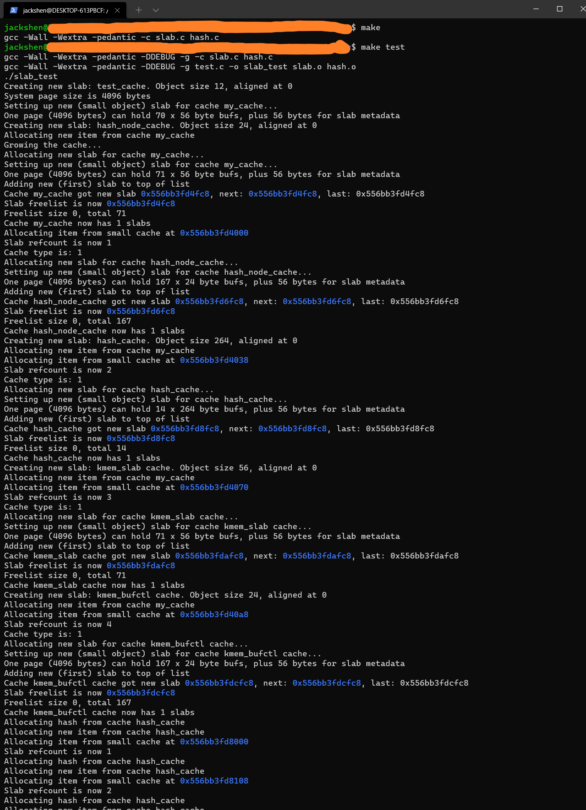
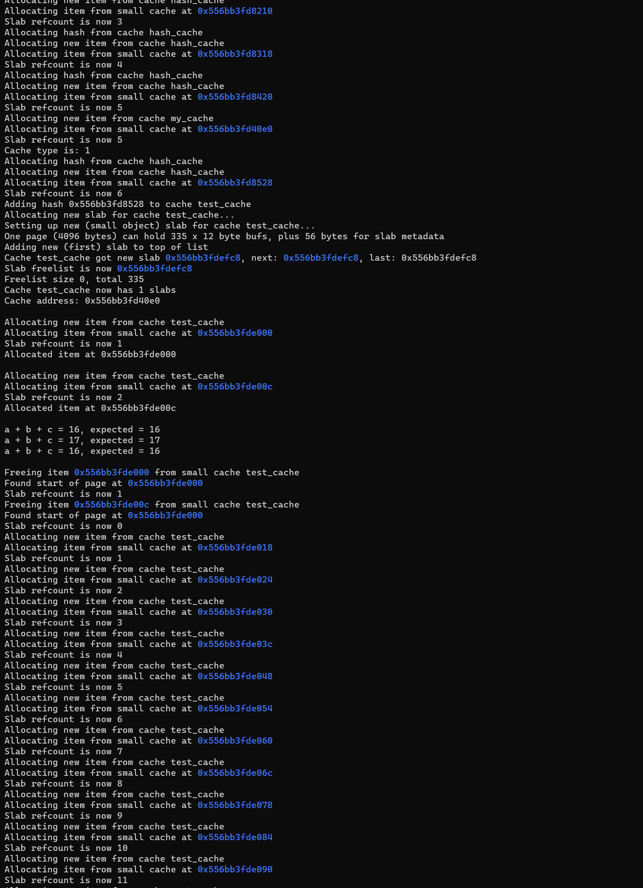
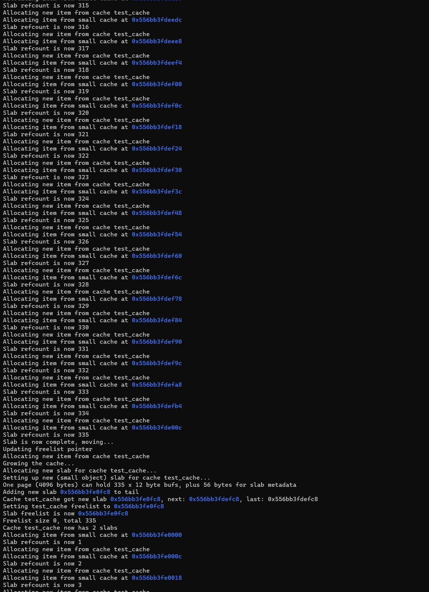
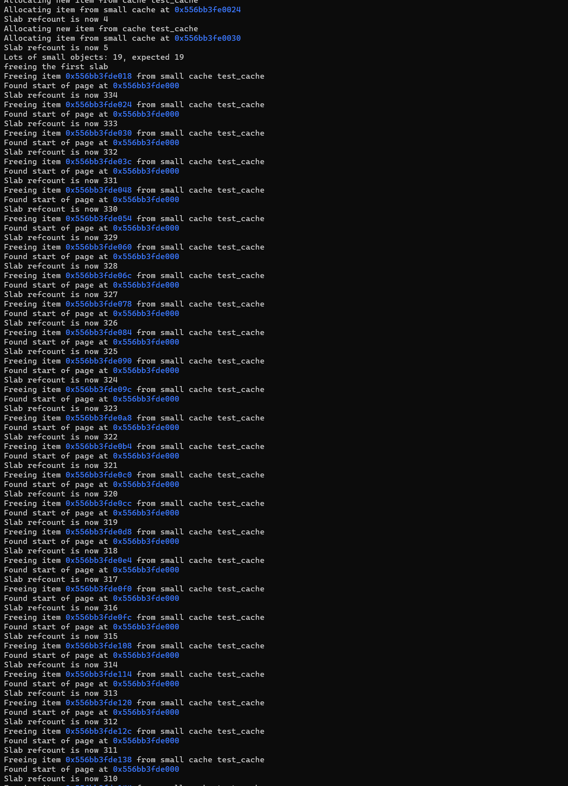
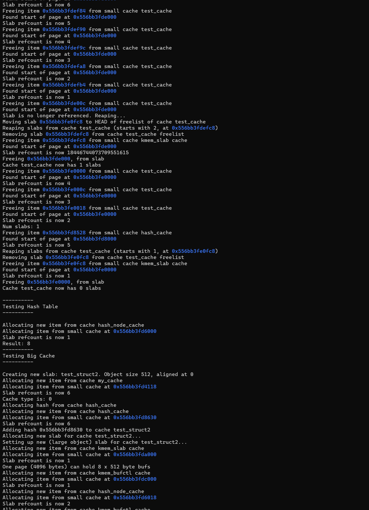
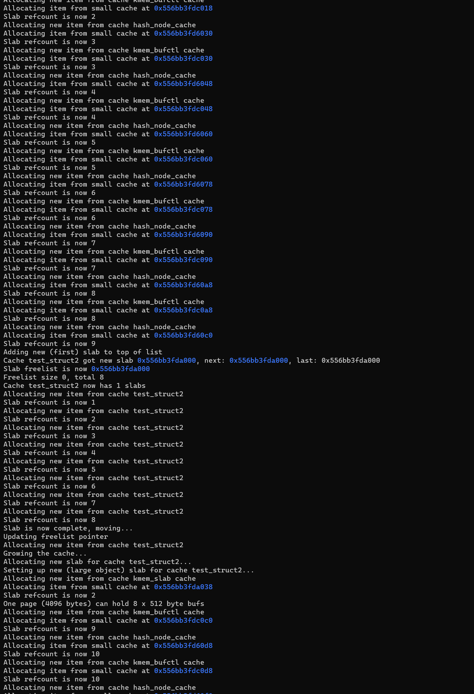
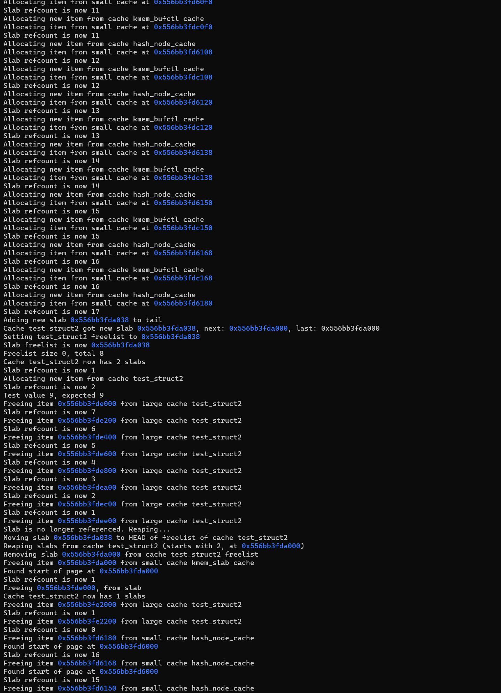
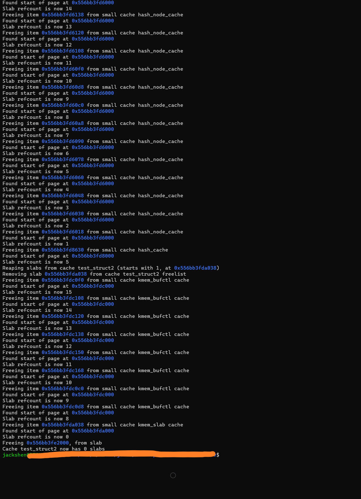

<h1 align="center">Slab Allocator</h1>

This work is a basic implementation of [**The Slab Allocator: An Object-Caching Kernel Memory Allocator**](https://people.eecs.berkeley.edu/~kubitron/courses/cs194-24-S14/hand-outs/bonwick_slab.pdf) by Jeff Bonwick.

## 📋 &nbsp;What is a slab allocator ?

The main idea of this mechanism is that objects of the same size are stored in the corresponding slab, from here the locator takes free objects and after freeing the objects are returned to the slab from where they were obtained. There can be several slabs in memory, both for objects of the same size, and for objects of different sizes, the number of sizes is limited due to the introduction of regularity of sizes.

To get an object from slab, it is enough to check whether the corresponding object cache is not empty. If the object cache is not empty, then the object is taken from the cache, if its slab has become full (all slab objects are busy), then the slab is taken from cache. When an object is released, it is returned as free to its slab. If the slab was full to this, then it is added to its cache. If slab becomes empty (all slab objects are free), the extent slab returns to its arena. If the object cache is empty, then the allocator gets a free extent of the appropriate size and creates a slab from it and adds this slab to its cache. These actions can be implemented in constant time.


Each slab must keep track of its objects and have pointers to link the slab in its cache. This accounting is kept in the slab's header. Objects are divided into small and big. Small objects are objects whose size is smaller or comparable to the size of the slab header, objects of other sizes are called big. The slab header with small objects is stored in the slab itself.  The slab header with big objects is stored in another slab object. Non-slab extent headers are stored in slab objects. If the allocator needs some memory, the allocator can request this memory from itself.
 
 
## 🚀 &nbsp;How to Run

1. Clone this repository;
2. Enter these commands in the console:

    ```shell
    >> make
    >> make test
    ```


## 📷 &nbsp;Results

The program was tested on big and small slabs. In general, I tested the basis case of

```c
struct kmem_cache *
kmem_cache_create(char *name, size_t size, size_t align);

void *
kmem_cache_alloc(struct kmem_cache *cp, int flags);

void
kmem_cache_free(struct kmem_cache *cp, void *buf);

void
kmem_cache_destroy(struct kmem_cache *cp);
```

<p align="center">
  
</p>

<p align="center">
  
</p>

<p align="center">
  
</p>

<p align="center">
  
</p>

<p align="center">
  
</p>

<p align="center">
  
</p>

<p align="center">
  
</p>

<p align="center">
  
</p>


## 📫 &nbsp;Get in touch

<p align="center">
<a href="https://www.linkedin.com/in/yevhenii-shendrikov-6795291b8/"></a>
<a href="mailto:jackshendrikov@gmail.com"></a>
<a href="https://www.facebook.com/jack.shendrikov"></a>
<a href=""></a>
</p>
